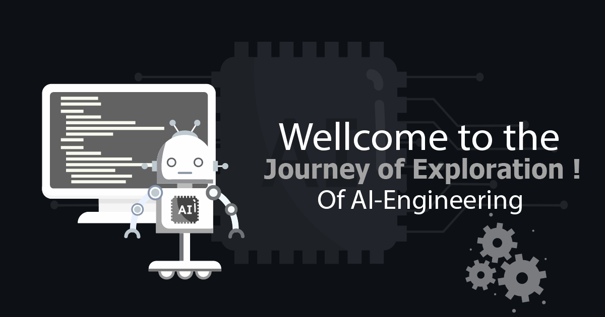

# 🌟 Welcome to a Journey Of AI-Engineering ! 👨‍💻

Hey there! I'm an enthusiastic AI Engineering student My Name is Muddasir Haider Khan. I Have Recently Passed out From School, at the beginning of an exciting journey into the world of artificial intelligence. With a rich IT background and a professional career as a graphic designer, I'm passionate about blending creativity with technology.

## 🛠️ Tech Arsenal:
- **AI Engineering:** Diving deep into AI, eager to innovate and create.
- **Dev Tools:** Mastering Docker, WSL, and VSCode, leveraging my IT expertise for a seamless transition into AI.

## 🎨 Design Mastery:
- **Adobe Illustrator**: Crafting vector magic.
- **Adobe Photoshop**: Turning ideas into digital masterpieces.

## ✨ My Mission:
As AI evolves, I'm on a mission to fuse my artistic flair with AI capabilities, transforming colors and creativity into functional, cutting-edge projects. I believe in the synergy of art and technology to bring innovative solutions to life.

🚀 **Stay Tuned!**
I might not have any repositories yet, but exciting projects are on the horizon! I'll be sharing my journey, projects, and learnings as I delve deeper into AI and explore new frontiers.

Let's connect and embark on this thrilling adventure in the AI world together!
